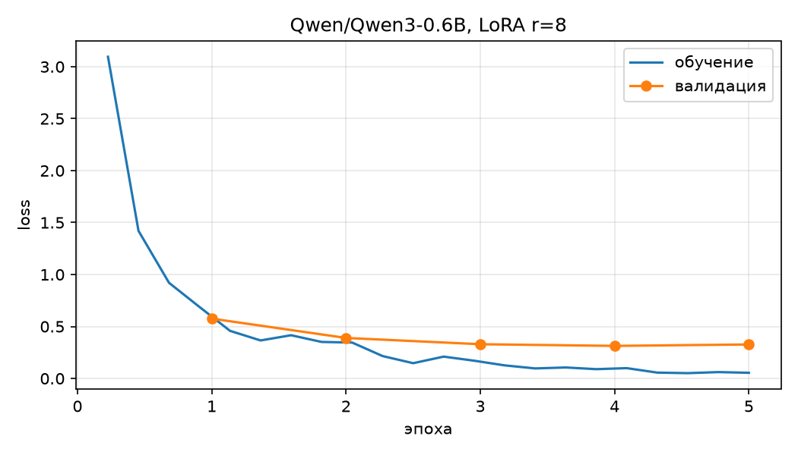

# Отчёт: DSL Query Generator

Базовая модель — `Qwen/Qwen3-0.6B`. Ноутбук — [notebook/ecql_lora.ipynb](../notebook/ecql_lora.ipynb)

Считалось на Apple Silicon: база в bf16, без квантования, батч 4 (эффективный 8).
В Colab на T4 база грузится в 4 битах через bitsandbytes — параметры адаптера
и обучения те же, отличается только точность базовых весов, поэтому метрики
могут разойтись.

## Датасет

276 пар «вопрос на русском — запрос на ECQL»: train 176, val 32, test 68.
В тесте 15 пар отмечены как трудные ([challenge.md](../dataset/ecql/source/challenge.md)).

Предметная область — путеводитель по Кавказским Минеральным Водам, четыре сущности:
`[PLACES]` места, `[REVIEWS]` отзывы, `[PROXIMITY]` соседние объекты, `[FARES]` цены проезда.

Покрыты: все поля каждой сущности, операторы `IS`, `NOT`, `ABOVE`, `BELOW`, `CONTAINS`,
`NOT CONTAINS`, связки `&&` и `||`, от одного до четырёх условий, суффиксы вывода
`AS JSON`, `AS TABLE`, `AS LIST`.

## Параметры LoRA

| Параметр | Значение | Почему |
|---|---|---|
| `r` | 8 | язык небольшой: четыре сущности, шесть операторов |
| `lora_alpha` | 16 | вдвое больше ранга, масштаб добавки равен 2 |
| `lora_dropout` | 0.05 | датасет маленький, лёгкий dropout сдерживает заучивание |
| `target_modules` | `q_proj`, `k_proj`, `v_proj`, `o_proj`, `gate_proj`, `up_proj`, `down_proj` | проекции внимания из задания плюс полносвязные слои |
| `learning_rate` | 2e-4 | рекомендация задания |
| эпохи | до 5, откат на лучшую по валидации | 176 пар за одну эпоху не усваиваются |

## График обучения

r=8: минимум валидации 0.313 на четвёртой эпохе, дальше рост — начало переобучения,
веса откатились на четвёртую эпоху.

r=4 ([график](../output/training/qwen3-0.6b-r4/loss.png)): к пятой эпохе 0.348 и всё ещё падал,
в потолок эпох не упёрся.

## Пять примеров из теста

Ответы адаптера r=8.

| Вопрос | Эталон | Ответ модели |
|---|---|---|
| Хочу почитать отзывы по Пятигорску и Лермонтову. | `FETCH [REVIEWS] WHERE @city IS 'Пятигорск' \|\| @city IS 'Лермонтов'` | совпал |
| Что в отзывах на «Оазис» говорят о чистоте? | `FETCH [REVIEWS] WHERE @name IS 'Оазис' && @aspects CONTAINS 'чистота'` | совпал |
| Кому из хостелов поставили три балла? | `FETCH [REVIEWS] WHERE @object_class IS 'hostel' && @rating IS 3` | `FETCH [REVIEWS] WHERE @rating IS 3 && @object_class IS 'hostel'` |
| Ищу поездку на трамвае за 20-40 рублей, покажи варианты. | `FETCH [FARES] WHERE @transport IS 'tram' && @price_rub ABOVE 20 && @price_rub BELOW 40` | `FETCH [FARES] WHERE @transport IS 'tram' && @price_rub BETWEEN 20 && 40` |
| Найди отзывы на два балла, где парковку обсуждают, а шум не упоминают. | `FETCH [REVIEWS] WHERE @aspects CONTAINS 'парковка' && @rating IS 2 && @aspects NOT CONTAINS 'шум'` | `FETCH [REVIEWS] WHERE @aspects NOT CONTAINS 'шум' && @rating IS 2` |

Третий ответ засчитан: порядок условий смысла не меняет.

## Разбор двух ошибок

**`BETWEEN` вместо двух условий.** В ECQL диапазон записывается как `ABOVE` нижней границы
и `BELOW` верхней. Модель подставила оператор SQL. Диапазон встречается в 17 парах из 176,
а `BETWEEN` попадается и у базовой модели с правилами языка в промпте — значит это привычка
из предобучения, которую 176 пар не перебили.

**Потерянное условие.** Из трёх условий модель вернула два, выбросив `@aspects CONTAINS 'парковка'`.
Оба условия по `@aspects` относятся к одному полю, и модель оставила по нему одно.
Ответов короче эталона 19 из 68.

## Результаты

Тест 68 записей, доли от 0 до 1.

| метрика | база, короткий промпт | база, полный промпт | адаптер r=8 | адаптер r=4 |
|---|---|---|---|---|
| синтаксис | 0.000 | 0.882 | 0.941 | 0.912 |
| логика | 0.000 | 0.059 | 0.191 | 0.191 |
| галлюцинации | 0.706 | 0.265 | 0.029 | 0.074 |

`синтаксис` — ответ построен по правилам ECQL. 

`логика` — запрос вернёт то же, что эталон (независимо от порядка логических операторов).

`галлюцинации` — чужой язык запросов или выдуманное поле.

## Трудные примеры

(не такие уж и трудные в итоге, но ладно)

15 записей теста написаны вручную и в обучение не попадали
([challenge.md](../dataset/ecql/source/challenge.md)): число словами, сокращение города,
отрицание, вопрос вместо команды. 

Посмотрим повлияли ли они на итоговые метрики для адаптера r=8:

| выборка | записей | синтаксис | логика | значения |
|---|---|---|---|---|
| challenge | 15 | 0.933 | 0.133 | 0.133 |
| обычные | 53 | 0.943 | 0.208 | 0.302 |
| весь тест | 68 | 0.941 | 0.191 | 0.265 |

Синтаксис на трудных не проседает. Логика ниже на 7 п.п., но вклад в общий итог 1.7 п.п.:
без challenge вышло бы 0.208 вместо 0.191. База с полным промптом на трудных даёт логику 0.000,
адаптер — два верных ответа из пятнадцати.

## Выводы

**Язык модель выучила, смысл вопроса — нет.** 
- Синтаксис 0.941 против 0.000 у базовой модели  на том же промпте, галлюцинации упали с 0.706 до 0.029: форму ECQL адаптер усвоил.
- Логика 0.191 — запрос возвращает нужные данные в 13 случаях из 68. 
- Узкое место: метрика `значения` 0.265 — доля ответов, где каждое условие
  получило правильное значение при правильном поле. Значение нужно либо взять
  из вопроса («Оазис»), либо перевести в термин перечня («гостевые дома» → guesthouse).

**Ранг 8 vs 4 - на синтаксис почти не влияет.** r=8 против r=4: 0.941 против 0.912, разница два ответа
из 68. Языку из четырёх сущностей и шести операторов
хватает ранга 4. Оговорка: r=4 к пятой эпохе ещё продолжал улучшаться, его результат —
нижняя оценка.

На логику ранг не повлиял: 0.191 против 0.191, по 13 верных ответов.

| часть логики | r=8 | r=4 |
|---|---|---|
| сущность | 0.838 | 0.735 |
| поля | 0.412 | 0.338 |
| операторы | 0.397 | 0.324 |
| значения | 0.265 | 0.235 |
| суффикс | 0.765 | 0.721 |
| **логика** | **0.191** | **0.191** |

У r=4 просела каждая часть, но на итог это не переносится — ответ засчитывается,
только когда совпали все пять частей сразу.

(напомню, что логика у меня - это метрика которая показывает долю идеальных ответов)

## Веса адаптеров

- r=8: https://drive.google.com/drive/folders/1AqNfOHRoeh0P37C4y6-GULrTaUho1wZ3?usp=sharing
- r=4: https://drive.google.com/drive/folders/1hgDSxBatX_-AWEab8QYdTPMwKFPmf754?usp=sharing

Ответы модели на тесте по каждому прогону — [output/runs/qwen3-0.6b/](../output/runs/qwen3-0.6b/).
